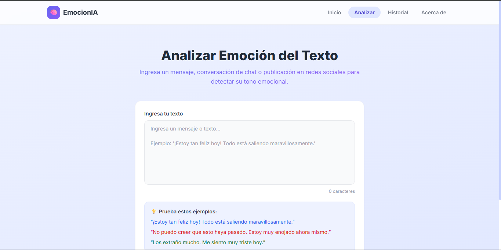
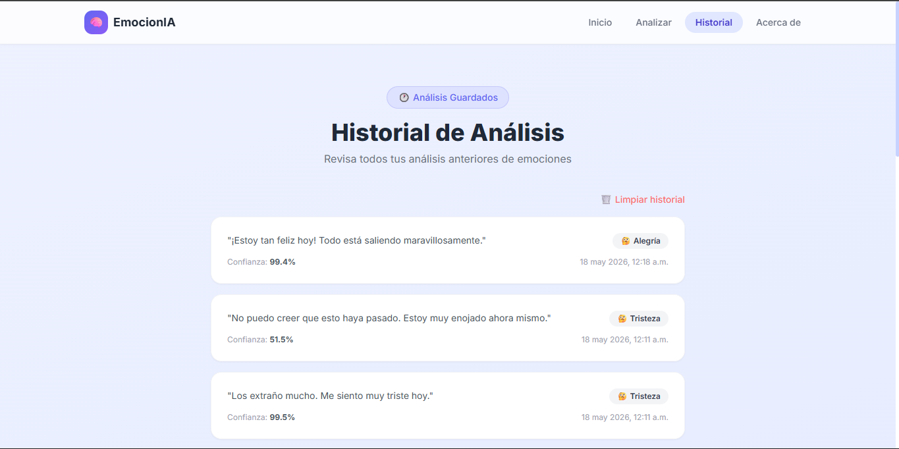

# EmocionIA — Detección de Estados Emocionales en Texto

<div align="center">
  
  
  
  
  
</div>

<br>

> Proyecto académico para el curso de Principios y Tecnologías de Inteligencia Artificial (PTIA) en la Escuela Colombiana de Ingeniería Julio Garavito.
> 
> MVP de arquitectura cliente-servidor que utiliza modelos Transformer para analizar texto informal en español y clasificarlo en seis estados emocionales.

---

## Interfaz


| Análisis de Emociones | Historial de Evaluaciones |
|:---:|:---:|
|  |  |

---

## Arquitectura

1. **Frontend (React + Vite):** Interfaz para capturar texto y mostrar análisis
2. **Backend (FastAPI):** Endpoint RESTful `/api/analyze` con CORS configurado
3. **Modelo (Hugging Face / PyTorch):** RoBERTuito para análisis de emociones en español

---

## 🚀 Requisitos Previos

- *Requisitos Previos

- Python 3.10+
- Node.js 18+ con npm
- Conexión a internet (primera ejecución descarga 500 MB del modelo)

## 🛠️ Instalación Previa

###Instalación

```bash
# Clonar y preparar backend
git clone <repository-url>
cd Proyecto-PTIA
cd backend
python -m venv venv
venv\Scripts\activate  # Windows
# source venv/bin/activate  # macOS/Linux
pip install -r requirements.txt
cd ..

# Preparar frontend
cd ..
```

---

## 🚀 Ejecución

### ✨ Opción 1: Script Python (RECOMENDADO - más confiable en Windows)

```bash
python run_dev.py
```
---

###Ejecución

### Opción 1: Automático (RECOMENDADO)

```bash
python run_dev.py
```

Inicia backend (puerto 8089) y frontend (puerto 5173) automáticamente.

### Opción 2: Manual

**Terminal 1 - Backend:**
```bash
cd backend
python -m uvicorn main:app --host 127.0.0.1 --port 8089
```

**Terminal 2 - Frontend
| Servicio | URL |
|----------|-----|
| **Frontend** | `http://localhost:5173` |
| **API** | `http://localhost:8089` |
| **Swagger (Docs)** | `http://localhost:8089/docs` |

---

## ⚠️ Solución de problemas

### Error `torch.lib.shm.dll` en Windows

Este es un problema conocido de PyTorch en Windows que ocurre cuando se usa `--reload`:

**Solución automática:** Usa `python run_dev.py` (sin `--reload`). Es lo recomendado.

**Si deseas usar `--reload` manualmente:**
```powershell
$env:OMP_NUM_THREADS = "1"
$env:MKL_NUM_THREADS = "1"
cd backend
python -m uvicorn main:app --host 127.0.0.1 --port 8089
```

Si aún así falla, reinicia el comando. El primer intento puede fallar, pero el segundo suele funcionar.

### El frontend no conecta con el backend

Verifica que:
1. El backend está corriendo en `http://localhost:8089`
2. Los puertos 8089 y 5173 estén disponibles (no bloqueados por firewall)
3. En el navegador, abre `http://localhost:8089/docs` para confirmar que la API responde

### Primera ejecución lenta
Accesos

| Servicio | URL |
|----------|-----|
| Frontend | http://localhost:5173 |
| API | http://localhost:8089 |
| Swagger (Docs) | http://localhost:8089/docs
### npm no encontrado

Si ves `npm: command not found`, asegúrate de tener Node.js instalado desde https://nodejs.org/
Notas

- Primera análisis: 30-60 segundos (descarga y compilación del modelo)
- Análisis posteriores: instantáneos
- En Windows, `run_dev.py` configura automáticamente variables de entorno para PyTorch
- **Métricas MVP:** Accuracy: 66.7% | F1-Score: 61.0% (Evaluado con dataset de prueba informal incluyendo modismos y sarcasmo).

---

## 👨‍💻 Autores

- **María Paula Rodríguez Muñoz**
- **Andrés Felipe Cardozo Martínez**

**Repositorio oficial:** [Andrew7480/Proyecto-PTIA](https://github.com/Andrew7480/Proyecto-PTIA)

---

## 📄 Licencia

Este proyecto se distribuye bajo la licencia **MIT**. Siéntete libre de utilizarlo y modificarlo con fines académicos o personales.